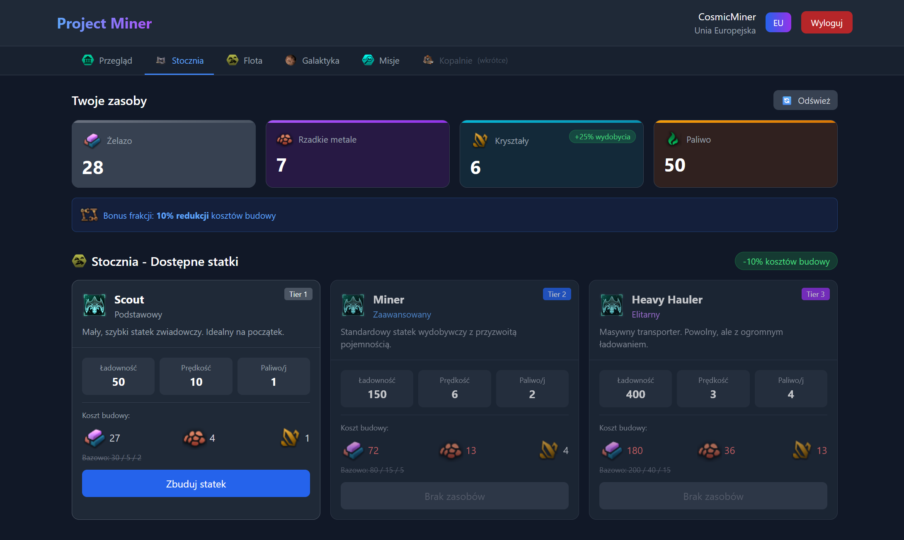

# Project Miner - Idle Browser Game

## Table of Contents
1. [Introduction](#introduction)
2. [Technologies](#technologies)
3. [Setup](#setup)
4. [Features](#features)
5. [Project Future](#future-plans)

## Introduction

**Project Miner** is a simple idle web-browser game ("idler"). Its main purpose is to setup a successful mining expedition and surpass your rivaling factions. You can fulfill this objective by few mechanics requiring abilities to manage resources and fleet.

## Technologies
The project is created in Typescript with following technologies;
* React 19.2
* Tailwind CSS 3.4
* Express 5.2
* MongoDB 7
* Mongoose 9.1
* Other libraries including Cors, Axios, Nodemon, BCrypt

## Setup
Follow those steps to setup the project locally;
1. `npm install`
2. Create .env file with variables `MONGO_DB` and `JWT_SECRET` 
3. `npm run seed`
4. `npm run server`
5. `npm start`

### Supporting code
You may need some additional commands while running the project. 
To spawn asteroids manually run `npm run seed -- --asteroids` 
You may also spawn required amount of asteroids `npm run seed -- --asteroids --count=5` 
To clear up seed - use: `npm run seed --force`

## Features
The game consists of following modules;
* Various modifiers depending on chosen faction;
* Creating fleet with various modifiers depending on its type;
* Establishing mines on planets in the Solar System;
* Succeeding in time-limited Extraction Missions;
* Managing your resources

## Future plans
Currently working on following functionalities;
* Custom icons
* Customization of the fleet
* Leaderboard
* New buildings
